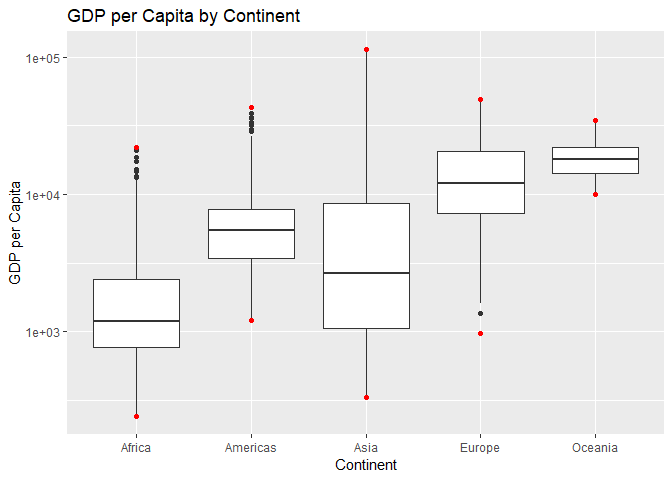
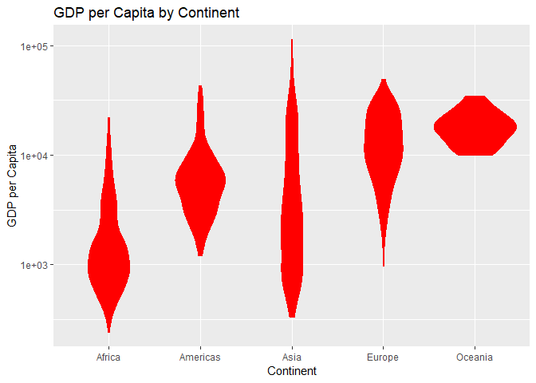

hw03\_yavyx
================

First, we'll load the necessary libraries:

``` r
suppressMessages(library(tidyverse))
library(gapminder)
library(knitr)
```

Then, we can start doing the tasks:

### Task 1

*Get the maximum and minimum of GDP per capita for all continents.*

``` r
min_max_gdp <- gapminder %>%
  group_by(continent) %>%
  summarize(min_gdp = min(gdpPercap), max_gdp = max(gdpPercap))

kable(min_max_gdp)
```

| continent |    min\_gdp|   max\_gdp|
|:----------|-----------:|----------:|
| Africa    |    241.1659|   21951.21|
| Americas  |   1201.6372|   42951.65|
| Asia      |    331.0000|  113523.13|
| Europe    |    973.5332|   49357.19|
| Oceania   |  10039.5956|   34435.37|

``` r
#Plotting
gapminder %>%
  ggplot(aes(continent, gdpPercap)) +
  geom_boxplot() +
  stat_summary(fun.y = min, color = "red", geom = "point") + #Add min points
  stat_summary(fun.y = max, color = "red", geom = "point") + #Add max points
  labs(title = "GDP per Capita by Continent", #Add labels
       x = "Continent", 
       y = "GDP per Capita") +
  scale_y_log10() #Log scale for more clarity
```



With this table and graph, we can easily see the minimum and maximum GDP per capita values for each continent. Also, we can see that the graph and table are showing the same min and max values for every continent.

### Task 2

*Look at the spread of GDP per capita within the continents.*

``` r
gdp_spread <- gapminder %>%
  group_by(continent) %>%
  summarize(gdp_StD = sd(gdpPercap), gdp_variance = var(gdpPercap))

kable(gdp_spread)
```

| continent |   gdp\_StD|  gdp\_variance|
|:----------|----------:|--------------:|
| Africa    |   2827.930|        7997187|
| Americas  |   6396.764|       40918591|
| Asia      |  14045.373|      197272506|
| Europe    |   9355.213|       87520020|
| Oceania   |   6358.983|       40436669|

``` r
gapminder %>%
  ggplot(aes(continent, gdpPercap)) +
  geom_violin(color = "red", fill = "red") +
  labs(title = "GDP per Capita by Continent", #Add labels
       x = "Continent", 
       y = "GDP per Capita") +
  scale_y_log10() #Log scale for more clarity
```



Here we can see in the table (which shows the standard deviation and variance of each continent) and violin plot how spread the data is in every continent. Once more, the information in both is the same and shows that Asia has the most spread and Africa has the least. It's very important to note that graphically Africa seems to have more spread than Oceania and other continents, however, because we are using a log scale in the y-axis to get a better visual representation of the data, this distorts the "violins". Because Africa has lower GDP per capita values than Oceania, its "violin" looks bigger, because the values in this setion of the y-axis are much lower and closer together. We can confirm this by plotting with a normal y axis scale:

``` r
gapminder %>%
  ggplot(aes(continent, gdpPercap)) +
  geom_violin(color = "red", fill = "red") +
  labs(title = "GDP per Capita by Continent", #Add labels
       x = "Continent", 
       y = "GDP per Capita")
```


Here, it's harder to discern the shape of the distributions because of the high values in Asia, but we can compare visually the spread for every continent, and clearly see that Africa has the least.

### Task 3

*Compute a trimmed mean of life expectancy for different years. Or a weighted mean, weighting by population. Just try something other than the plain vanilla mean.*

``` r
trimmed_mean <- gapminder %>%
  group_by(year,continent) %>%
  summarize(trimmed_mean = mean(lifeExp, trim = 0.125))

spread_trimmed_mean <- spread(trimmed_mean, key = "year", value = "trimmed_mean")

kable(spread_trimmed_mean)
```

| continent |      1952|      1957|      1962|      1967|      1972|      1977|      1982|      1987|      1992|      1997|      2002|      2007|
|:----------|---------:|---------:|---------:|---------:|---------:|---------:|---------:|---------:|---------:|---------:|---------:|---------:|
| Africa    |  38.94190|  40.95485|  43.04780|  45.11923|  47.23873|  49.32413|  51.27950|  52.95470|  53.67950|  52.98172|  52.26792|  53.92968|
| Americas  |  53.09632|  56.01521|  58.67721|  60.78905|  62.89468|  64.88337|  66.82300|  68.62984|  70.05458|  71.63363|  72.85332|  73.98595|
| Asia      |  45.79096|  48.99628|  51.28929|  54.71380|  57.78964|  60.54929|  63.14608|  65.45380|  67.08984|  68.53728|  69.87688|  71.33388|
| Europe    |  65.09708|  67.30763|  69.07921|  70.19675|  71.14942|  72.22067|  73.09983|  73.96738|  74.73196|  75.77375|  76.88962|  77.82504|
| Oceania   |  69.25500|  70.29500|  71.08500|  71.31000|  71.91000|  72.85500|  74.29000|  75.32000|  76.94500|  78.19000|  79.74000|  80.71950|

``` r
#Plotting
trimmed_mean %>%
  ggplot(aes(year, trimmed_mean)) +
  geom_point(aes(color = continent)) +
  geom_line(aes(color = continent)) +
  labs(title = "Life Expectancy by Continent (Trimmed mean)", #Add labels
       x = "Year", 
       y = "Life Expectancy")
```


Here we can see the trend for life expectancy in all the continents is going up. For the table, we used the `tidyr::spread()` function to make it more visually appealing to us. The trimmed argument discards 12.5% percent on each side of the distribution in each continent.

### Task 4

*How is life expectancy changing over time on different continents?*

``` r
change_lifeExp <- gapminder %>%
  group_by(continent) %>%
  mutate(change_lifeExp = lifeExp - lag(lifeExp)) %>% #Calculate change in each continent
  group_by(year, continent) %>%
  summarize(mean_change = mean(change_lifeExp)) %>% #Calculate mean of changes
  na.omit() #Remove NA values
  
spread_lifeExp <- spread(change_lifeExp, key = "year", value = "mean_change")

kable(spread_lifeExp)
```

| continent |      1957|      1962|      1967|      1972|      1977|       1982|       1987|       1992|        1997|        2002|      2007|
|:----------|---------:|---------:|---------:|---------:|---------:|----------:|----------:|----------:|-----------:|-----------:|---------:|
| Africa    |  2.130846|  2.053096|  2.015096|  2.116404|  2.129481|  2.0124423|  1.7519231|  0.2847885|  -0.0313077|  -0.2730385|  1.480808|
| Americas  |  2.680440|  2.438480|  2.012160|  1.984000|  1.996640|  1.8372800|  1.8618800|  1.4776400|   1.5821200|   1.2715600|  1.186080|
| Asia      |  3.004150|  2.244679|  3.100417|  2.655629|  2.291287|  3.0073830|  2.2332424|  1.6860303|   1.4833030|   1.2133636|  1.494606|
| Europe    |  2.294567|  1.836167|  1.198367|  1.037433|  1.162733|  0.8686333|  0.8357667|  0.7979333|   1.0650667|   1.1954333|  0.948000|
| Oceania   |  1.040000|  0.790000|  0.225000|  0.600000|  0.945000|  1.4350000|  1.0300000|  1.6250000|   1.2450000|   1.5500000|  0.979500|

``` r
#Plotting
change_lifeExp %>%
  ggplot(aes(year, mean_change)) +
  geom_point(aes(color = continent)) +
  geom_line(aes(color = continent)) +
  labs(title = "Life Expectancy Change by Continent", #Add labels
       x = "Year", 
       y = "Life Expectancy Change") 
```


In this plot and table we can see the change for life expectancy in each country. In a way, it's the derivative of the life expectancy for every continent. The only continent to ever have a drop in life expectancy was Africa in 1997 and 2002.

### Task 5

*Report the absolute and/or relative abundance of countries with low life expectancy over time by continent: Compute some measure of worldwide life expectancy – you decide – a mean or median or some other quantile or perhaps your current age. Then determine how many countries on each continent have a life expectancy less than this benchmark, for each year.*

``` r
lifeExp_mean <- mean(gapminder$lifeExp)

low_lifeExp <- gapminder %>%
  group_by(continent, year) %>%
  summarize(low_lifeExp = sum(lifeExp <= lifeExp_mean) / length(continent)) #Get the relative frequency of the countries below the overall life expectancy

spread_low_lifeExp <- spread(low_lifeExp, key = "year", value = "low_lifeExp")

kable(spread_low_lifeExp)
```

| continent |       1952|       1957|       1962|       1967|       1972|       1977|       1982|       1987|       1992|       1997|       2002|       2007|
|:----------|----------:|----------:|----------:|----------:|----------:|----------:|----------:|----------:|----------:|----------:|----------:|----------:|
| Africa    |  1.0000000|  1.0000000|  0.9807692|  0.9615385|  0.9615385|  0.9423077|  0.8269231|  0.7500000|  0.7307692|  0.7500000|  0.7884615|  0.7692308|
| Americas  |  0.7600000|  0.6000000|  0.5200000|  0.4000000|  0.3200000|  0.2800000|  0.2000000|  0.0800000|  0.0400000|  0.0400000|  0.0400000|  0.0000000|
| Asia      |  0.8787879|  0.7878788|  0.7575758|  0.6969697|  0.5757576|  0.4242424|  0.3333333|  0.2424242|  0.2121212|  0.1818182|  0.0909091|  0.0303030|
| Europe    |  0.1666667|  0.1000000|  0.0333333|  0.0333333|  0.0333333|  0.0000000|  0.0000000|  0.0000000|  0.0000000|  0.0000000|  0.0000000|  0.0000000|
| Oceania   |  0.0000000|  0.0000000|  0.0000000|  0.0000000|  0.0000000|  0.0000000|  0.0000000|  0.0000000|  0.0000000|  0.0000000|  0.0000000|  0.0000000|

``` r
#Plotting
low_lifeExp %>%
  ggplot(aes(year, low_lifeExp)) +
  geom_point(aes(color = continent)) +
  geom_line(aes(color = continent)) +
  labs(title = "Relative abundance of countries below the average Life Expectancy", #Add labels
       x = "Year", 
       y = "Proportion below average Life Expectancy") +
  scale_y_continuous(labels = scales::percent) #Change y-axis labels to percentage
```


We can see that Africa has always had the highest proportion of countries with below average life expectancy, while Oceania never had any, and Europe hasn't had any since 1977.

References
----------

[Stack Overflow](https://stackoverflow.com/) was used many times for coding strategies.

[Homework 2](https://github.com/STAT545-UBC-students/hw02-yavyx), [participation from cm007](https://github.com/yavyx/STAT545_participation/blob/master/cm007/cm007-exercise.Rmd), [participation from cm008](https://github.com/yavyx/STAT545_participation/tree/master/cm008/cm008-exercise.Rmd) and [participation from cm009](https://github.com/yavyx/STAT545_participation/blob/master/cm009/cm009-exercise.Rmd) from the class were also very useful.
